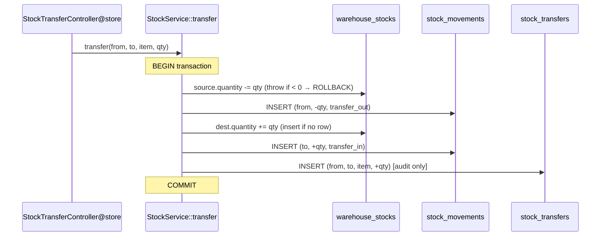

# How the system works — a developer's reference

A code-grounded walkthrough of what every page/route does: **which tables and exact columns get
written**, what fires automatically (observers/activity logging), and the **step-by-step DB writes**
for the inventory flows (movements, transfers, takes) and the order/production flows.

Audience: whoever maintains this system. Every claim cites a `file:line` so you can jump to the
source. Pair this with [`docs/USER-GUIDE.md`](USER-GUIDE.md) (end-user, task-oriented) — this file
is the internals.

> **Read this first — three things that surprise people:**
> 1. **There is no document-number generator.** Orders/returns/production are identified by their
>    integer `id` (the UI shows `PO #5`). The `PO`/`SO`/`INV` prefixes, `number_reset`, and
>    `financial_year_start_month` business settings are *declared but read nowhere* — not yet wired.
> 2. **There are no custom observers/events/listeners** (no `app/Observers|Listeners|Events`). The
>    only automatic model hooks are Spatie **activity logging** (via the `RecordsActivity` trait) and
>    two **delete guards** (`booted()` on `Location` and `Warehouse`).
> 3. **Stock direction is the sign of `quantity`** — there is no in/out flag column. A `+` row adds
>    on-hand, a `−` row subtracts. A single transfer writes **5 rows**.

---

## Table of contents
0. [Global conventions](#0-global-conventions)
1. [Data model at a glance](#1-data-model-at-a-glance)
2. [Master-data CRUD](#2-master-data-crud)
3. [Inventory engine (the deep chapter)](#3-inventory-engine-the-deep-chapter)
4. [Documents: orders, returns, production](#4-documents-orders-returns-production)
5. [Read-only pages](#5-read-only-pages)
6. [Cross-cutting infrastructure](#6-cross-cutting-infrastructure)
7. [Appendix](#7-appendix)

---

## 0. Global conventions

These hold across almost every screen, so they aren't repeated per-resource.

- **Routing & tenancy.** All app routes live in [`routes/tenant.php`](../routes/tenant.php), wrapped
  in `web` + `InitializeTenancyByPath`, prefixed `/{tenant}` (the slug), and named `tenant.*`. Every
  business route is behind `auth:web` (`routes/tenant.php:78`). Once the slug resolves, models run on
  the **tenant database** (its own DB — no `organization_id` columns).
- **How writes happen.** Models declare `#[Fillable([...])]`. Controllers do
  `Model::create($request->validated())` / `$model->update($request->validated())`, so the columns
  written are exactly *fillable ∩ validated payload* — `id`/`created_at`/`updated_at` are managed by
  Laravel, never set by hand.
- **Index screens** share `resourceIndex()`
  ([`app/Http/Controllers/Concerns/RendersResourceIndex.php:24`](../app/Http/Controllers/Concerns/RendersResourceIndex.php)):
  `search`-scoped → `latest()->latest('id')` → paginated → mapped through a `*Data` DTO, with a
  `filters` prop. Every mutating action returns `back()` with a flash toast (`RespondsWithToast`).
- **FK existence** is validated with `ActiveExists::of($table)`
  ([`app/Support/ActiveExists.php:19`](../app/Support/ActiveExists.php)) =
  `Rule::exists($table,'id')->whereNull('deleted_at')` — i.e. the referenced row must exist **and not
  be soft-deleted**.
- **Morph aliases.** Polymorphic `*_type` columns store short aliases, not class names, via
  `Relation::morphMap` ([`app/Providers/AppServiceProvider.php:44`](../app/Providers/AppServiceProvider.php)):
  `product` → `Product`, `raw_material` → `RawMaterial`, `setting` → `Setting`. So `stockable_type` is
  `'product'`/`'raw_material'`, and `media.model_type` is `'product'`/`'setting'`.
- **Decimals.** All quantities/prices are `decimal(15,4)`.

---

## 1. Data model at a glance

| Domain | Tables | Delete behavior |
|---|---|---|
| **Master data** | `categories`, `suppliers`, `customers`, `raw_materials`, `products`, `bom_items`, `locations`, `warehouses`, `warehouse_reorder_levels`, `settings` | Soft-delete (`deleted_at`) on the first 5 + `locations`/`warehouses`; **hard/no-delete** on `bom_items` (replace-on-save), `warehouse_reorder_levels` (upsert-only), `settings` (upsert-only) |
| **Inventory** | `stock_movements` (ledger), `warehouse_stocks` (on-hand), `stock_transfers` (audit), `stock_takes` + `stock_take_items` | Ledger/on-hand/transfers never deleted; `stock_takes` soft-delete |
| **Documents** | `purchase_orders`(+`_items`), `purchase_returns`(+`_items`), `sales_orders`(+`_items`), `sales_returns`(+`_items`), `production_orders`(+`_items`) | Headers soft-delete; `*_items` hard-delete-and-recreate on edit |
| **System** | `activity_log`, `media`, `settings`, tenant `users` | append-only / library-managed |

The polymorphic **`stockable`** (a `product` or `raw_material`) is the spine of inventory — it's what
`stock_movements`, `warehouse_stocks`, `stock_transfers`, `stock_take_items`, and
`warehouse_reorder_levels` all point at.

---

## 2. Master-data CRUD

All of these are simple `Route::resource(...)->only(['index','store','update','destroy'])` and follow
the same shape: `store`/`update` write the fillable columns; `destroy` soft-deletes; every change is
activity-logged (except where noted).

### Categories — `CategoryController`, table `categories`
- **Routes** (`routes/tenant.php:82`): `index/store/update/destroy`; page `tenant/categories/index`.
- **Columns written** (`categories`): `name` (unique), `description`.
- **Validation** (`CategoryRequest`): `name` required, unique (ignoring self); `description` ≤1000.
- **Delete**: soft-delete. **Activity-logged.**

### Suppliers — `SupplierController`, table `suppliers`
- **Columns**: `name`, `email` (nullable, unique), `phone`, `address`, `notes`.
- **Validation**: `name` required; `email` optional + unique; rest nullable.
- Soft-delete. **Activity-logged.**

### Customers — `CustomerController`, table `customers`
- Structurally identical to suppliers (`name`, `email` unique, `phone`, `address`, `notes`). Soft-delete. **Activity-logged.**

### Raw materials — `RawMaterialController`, table `raw_materials`
- **Columns**: `name`, `sku` (unique), `unit`.
- Soft-delete. **Activity-logged.** (Also provides `snapshot()` — see [HasSnapshot](#hassnapshot).)

### Products — `ProductController`, table `products` (+ `bom_items`, + `media`)
- **Routes**: resource + `PUT products/{product}/bom` (`routes/tenant.php:94`). Image is served via
  the shared media route (§5), not a product-specific endpoint.
- **Columns** (`products`): `name`, `sku` (unique), `barcode`, `description`, `category_id`
  (nullable FK), `supplier_id` (nullable FK), `unit`.
- **Image**: on `store`/`update`, an uploaded `image` is written to the `media` table via
  `addMedia()->toMediaCollection('image')` (single-file → replaces the previous); `remove_image=true`
  clears it. The image is **kept on soft-delete**, removed only on force-delete
  (`ProductController.php:118`).
- **BOM** (`updateBom`, `ProductController.php:61`): inside a `DB::transaction`, it **hard-deletes all
  existing `bom_items` for the product and re-creates them** from the submitted `items[]` — a full
  replace. Each `bom_items` row = `product_id`, `raw_material_id`, `quantity`; unique
  `(product_id, raw_material_id)`. (`bom_items` has no `deleted_at`.)
- **Validation** (`ProductRequest`): `sku` required + unique; `category_id`/`supplier_id` optional +
  `ActiveExists`; `image` ≤2 MB jpg/png/webp. `BomRequest`: each `raw_material_id` distinct +
  `ActiveExists`, `quantity > 0`.
- Soft-delete. **Product + BomItem are activity-logged** (the BOM replace logs each delete/create).

### Locations — `LocationController`, table `locations`
- **Columns**: `name`, `code` (nullable, unique), `address`.
- **Delete guard**: `booted()` `deleting` hook throws `BlockedByDependentsException` if the location
  still has warehouses (`Location.php:46`); the FK `restrictOnDelete` on `warehouses.location_id`
  backstops it. Soft-delete otherwise. **Activity-logged.**

### Warehouses — `WarehouseController`, table `warehouses` (+ `show` page)
- **Columns**: `location_id` (FK, restrict), `name`, `code` (nullable, unique), `address`.
- **`show`** (`GET warehouses/{warehouse}`) is **read-only**: a UNION over `products` + `raw_materials`
  left-joined to `warehouse_stocks` and `warehouse_reorder_levels` to show on-hand vs reorder level
  (`WarehouseController.php:63`). No writes.
- **Delete guard**: `booted()` throws `BlockedByDependentsException` if any `warehouse_stocks.quantity
  != 0` for it (`Warehouse.php:61`). Soft-delete otherwise. **Activity-logged.**

### Warehouse reorder levels — `WarehouseReorderLevelController` (write-only endpoint)
- **Route**: `PUT warehouses/{warehouse}/reorder-levels` (`routes/tenant.php:102`); the values surface
  on the warehouse `show` page (no dedicated index).
- **Write** (`WarehouseReorderLevelController.php:17`): `updateOrCreate` keyed on
  `(warehouse_id, stockable_type, stockable_id)`, setting `min_stock` — **insert-or-update**, one row
  per (warehouse, item). No delete path; cascades only on warehouse force-delete.
- **Validation**: `stockable_type` `in:product,raw_material`; `stockable_id` `ActiveExists` for that
  table; `min_stock ≥ 0`. **Activity-logged.**

### Settings (business) — `SettingsController`, table `settings`
- **Routes** (`routes/tenant.php:194`): `GET/PUT settings/{category}`; only `business` is registered
  (`SettingsRegistry.php:14`) — any other slug 404s. Page `tenant/settings/index`.
- **Write** (`SettingsController.php:38`): validates schema-derived rules, then `Setting::putMany()`
  **upserts one `settings` row per `(category, key)`** with the encoded `value`
  (`Setting.php:51`). The **logo is not a column** — it's a `media` row in the `file` collection on
  the logo's Setting row (`SettingsCategory.php:159`); `remove_logo` clears it.
- The business fields (each a `settings` row, `category='business'`): `legal_name`, `registration_no`,
  `logo` (file), `email`, `phone`, `address`, `country`, `tax_type`, `tax_registration_no`, `tin`,
  `default_currency`, `financial_year_start_month`, `sales_order_prefix`, `purchase_order_prefix`,
  `invoice_prefix`, `number_reset` (`BusinessSettings.php:37`).
- **No delete** (upsert-only). **⚠ Not activity-logged** — `Setting` lacks `RecordsActivity`, so
  business-settings edits do *not* appear in the activity log (unlike every other master-data
  resource). The prefix/reset/financial-year fields are **stored but not consumed anywhere** (see
  [numbering](#numbering-declared-but-not-wired)).

### Column reference (master data)

| Table | Columns (besides `id` + timestamps) | Soft-delete? |
|---|---|---|
| `categories` | `name`(uniq), `description` | ✔ |
| `suppliers` / `customers` | `name`, `email`(uniq), `phone`, `address`, `notes` | ✔ |
| `raw_materials` | `name`, `sku`(uniq), `unit` | ✔ |
| `products` | `name`, `sku`(uniq), `barcode`, `description`, `category_id`, `supplier_id`, `unit` | ✔ |
| `bom_items` | `product_id`, `raw_material_id`, `quantity`; uniq `(product_id,raw_material_id)` | ✘ (replace-on-save) |
| `locations` | `name`, `code`(uniq), `address` | ✔ |
| `warehouses` | `location_id`, `name`, `code`(uniq), `address` | ✔ |
| `warehouse_reorder_levels` | `warehouse_id`, `stockable_type`, `stockable_id`, `min_stock`(dflt 0); uniq triple | ✘ (upsert) |
| `settings` | `category`, `key`, `value`; uniq `(category,key)` | ✘ (upsert) |

---

## 3. Inventory engine (the deep chapter)

This is the heart of the system and the part most worth understanding.

### 3.1 One gateway: `StockService`

**Every on-hand mutation goes through [`app/Services/StockService.php`](../app/Services/StockService.php).**
No controller writes `warehouse_stocks` or `stock_movements` directly. The service keeps two tables in
lockstep inside a DB transaction: the append-only **ledger** (`stock_movements`) and the materialized
**on-hand** (`warehouse_stocks`).

Public methods:
- **`record(warehouse, stockable, delta, reason, user, notes)`** (`:30`) — the atom. Applies a
  **signed** `delta` to on-hand, then appends one ledger row. Wrapped in `DB::transaction`.
- **`transfer(from, to, stockable, quantity, user, notes)`** (`:52`) — two `record()` calls + one
  `stock_transfers` insert, all in one transaction.
- **`setLevel(warehouse, stockable, target, user, notes)`** (`:83`) — reads current on-hand under
  lock, computes `delta = target − current`, applies it, logs `reason = adjustment`.
- **`onHand(warehouse, stockable)`** (`:105`) — **unlocked** read for display; returns
  `warehouse_stocks.quantity` or `0`.

The private core, `applyLockedDelta()` (`:120`), is the crux:
1. `SELECT ... FOR UPDATE` the on-hand row (`lockedStock`, `:154`) — serializes concurrent writers.
2. `new = current + delta`.
3. **If `new < 0` → throw `InsufficientStockException`** (`:127`) — the single negative-stock choke
   point; it rolls back the whole transaction.
4. `UPDATE` the row if it exists, else `INSERT` a new one.

`writeMovement()` (`:165`) is the **only** place `stock_movements` rows are created.

> **Key idea:** there is no "in/out" column. `record()` takes a *signed* delta — `+` adds, `−`
> subtracts — and that same signed number is stored in `stock_movements.quantity`. The on-hand table
> is always kept ≥ 0 by the guard.

### 3.2 The two core tables

**`stock_movements`** — the ledger (`2026_07_10_000003_create_stock_movements_table.php`). Append-only:
never updated or deleted, no soft-deletes, no unique constraint (duplicates are expected).

| Column | Type | Notes |
|---|---|---|
| `warehouse_id` | FK → warehouses | `restrictOnDelete`; relation uses `withTrashed()` so history survives |
| `stockable_type` / `stockable_id` | morphs | `product` / `raw_material` |
| `quantity` | decimal(15,4) | **signed** (+ in / − out) |
| `reason` | string(30) | `StockMovementReason` enum (see [appendix](#stockmovementreason-catalog)) |
| `user_id` | FK → users, nullable | `nullOnDelete` |
| `notes` | text, nullable | e.g. `"PO #5"`, `"Stock take #3"` |

**`warehouse_stocks`** — materialized on-hand (`2026_07_10_000004_...`). Exactly one row per
(warehouse, item), enforced by a **unique `(warehouse_id, stockable_type, stockable_id)`**. Columns:
`warehouse_id` (FK, **cascade**), `stockable_type`/`stockable_id`, `quantity` (decimal(15,4), default
0). Updated only by `StockService` via the locked read-modify-write above — never a raw SQL
increment.

### 3.3 A single manual movement — `StockMovementController@store`

`POST stock-movements` (`routes/tenant.php:107`). The form sends `stockable` (`"product:5"`),
`warehouse_id`, `type` (`in`/`out`/`adjustment`), `quantity`, `notes`. The controller
(`StockMovementController.php:82`) branches on `type`:

| UI `type` | Calls | On-hand effect | Ledger row |
|---|---|---|---|
| `in` | `record(wh, item, +qty, Adjustment)` | `+qty` | `quantity=+qty`, `reason=adjustment` |
| `out` | `record(wh, item, −qty, Adjustment)` | `−qty` (guarded) | `quantity=−qty`, `reason=adjustment` |
| `adjustment` | `setLevel(wh, item, qty, ...)` | sets on-hand **to** `qty` | `quantity=(qty−current)`, `reason=adjustment` |

**All three log `reason = adjustment`** — the distinction is sign-vs-absolute at write time, not the
stored reason. Example — first-ever `type=in`, qty 10, product 5, warehouse 2:
1. **INSERT `warehouse_stocks`**: `(warehouse 2, product 5, quantity 10)` (no prior row → insert).
2. **INSERT `stock_movements`**: `(warehouse 2, product 5, quantity +10, reason adjustment, user, notes)`.

`InsufficientStockException` is caught and returned as a 422 on the `quantity` field
(`StockMovementController.php:97`).

### 3.4 A stock transfer — `StockTransferController@store` (writes 5 rows)

`POST stock-transfers` (`routes/tenant.php:113`). Form: `stockable`, `from_warehouse_id`,
`to_warehouse_id` (must be `different`), `quantity` (`gt:0`), `notes`. The controller resolves the
inputs and calls `StockService::transfer()`, which runs **one transaction** containing, in order:

1. `record(from, item, −qty, TransferOut)` →
   - **UPDATE `warehouse_stocks`** (source): `quantity −= qty` (throws & aborts everything if it would
     go negative).
   - **INSERT `stock_movements`**: `quantity = −qty`, `reason = transfer_out`, `warehouse = from`.
2. `record(to, item, +qty, TransferIn)` →
   - **UPDATE or INSERT `warehouse_stocks`** (destination): `quantity += qty`.
   - **INSERT `stock_movements`**: `quantity = +qty`, `reason = transfer_in`, `warehouse = to`.
3. **INSERT `stock_transfers`**: `from_warehouse_id`, `to_warehouse_id`, `stockable_type/id`,
   `quantity` (**positive magnitude**), `user_id`, `notes`.

So **one transfer = 5 writes**: 2 ledger rows (OUT then IN), up to 2 on-hand mutations (source
decrement, dest increment/insert), and 1 `stock_transfers` audit row — all atomic. The **OUT is
written first**, so an insufficient source aborts before anything commits. The `stock_transfers` row
is a document/audit record only — on-hand is moved by the two `stock_movements`, not by it.



`stock_transfers` columns: `from_warehouse_id` (FK, restrict), `to_warehouse_id` (FK, restrict),
`stockable_type`/`stockable_id`, `quantity` (positive), `user_id` (nullable), `notes`.

### 3.5 Stock take — `StockTakeController` + `PostStockTake`

A physical count that posts variance adjustments. Two tables:
- **`stock_takes`**: `warehouse_id` (FK, cascade), `status` (`draft`/`posted`/`cancelled`, default
  `draft`), `user_id`, `counted_at` (nullable), `notes`; **soft-deletes**.
- **`stock_take_items`**: `stock_take_id` (FK, cascade), `stockable_type`/`stockable_id`,
  `stockable_snapshot` (json `{name,sku,unit}`), `system_qty` (on-hand at snapshot), `counted_qty`,
  `variance` (default 0).

Lifecycle:
1. **`store`** (`StockTakeController.php:62`, in a transaction): creates the `stock_takes` row as
   `draft`, then **snapshots every current `warehouse_stocks` row** for that warehouse into
   `stock_take_items` — `system_qty = counted_qty = current on-hand`, `variance = 0`. No ledger/on-hand
   writes yet.
2. **`post`** (`→ App\Actions\PostStockTake`): only a `draft` may post (422 otherwise). Per item:
   `counted = submitted ?? existing`; **stores** `variance = counted − system_qty` on the item; then —
   crucially — computes the ledger **`delta = counted − live on-hand`** (re-reads current
   `warehouse_stocks`, *not* the snapshot) and, if non-zero, calls `record(..., delta, StockTake,
   "Stock take #id")`. Finally sets `status = posted`, `counted_at = now()`.
3. **`cancel`**: draft-only status flip to `cancelled`; no stock effect. **`destroy`**: soft-delete.

> **Nuance to remember:** the stored `variance` (`counted − system_qty`, snapshot-based) can differ
> from the actually-posted ledger delta (`counted − live on-hand`) if stock moved between the
> snapshot and the post. The ledger always corrects on-hand to the **counted** figure.

### 3.6 On-hand lookup — `StockLookupController@onHand`

`GET stock/on-hand` (`routes/tenant.php:117`) — read-only JSON for the movement/transfer dialogs.
Returns `{ on_hand: float, unit: string, reorder_level: float|null }` (`StockOnHandData`);
`reorder_level` is null when no `warehouse_reorder_levels` row exists for the pair.

### 3.7 Guards & concurrency (inventory)

- **Transactions** wrap every mutating path (`record`, `transfer`, `setLevel`, take `store`, take
  `post`). `transfer` is one outer transaction around two nested `record` calls + the transfer insert.
- **Row locking**: `lockForUpdate()` on the on-hand row serializes concurrent writers, so two
  simultaneous OUTs can't both read the same pre-balance and over-draw.
- **Negative-stock guard**: the single choke point in `applyLockedDelta` — any delta driving on-hand
  below zero throws `InsufficientStockException`, which controllers convert to a 422 on `quantity`
  (movements/transfers) or `warehouse_id` (order actions).
- **No observers/events** on `StockMovement`/`WarehouseStock`/`StockTransfer` — consistency comes
  purely from the service's transaction + lock.

---

## 4. Documents: orders, returns, production

Five document types, all the same shape.

**Shared shape:**
- A **header** table + a **line-items** table.
- `status` starts `pending`; the state action moves it to a **terminal** state; `cancel` moves it to
  `cancelled`. Editing (`update`) is allowed **only while `pending`** (`abort_unless(... 422)`).
- `store`/`update` run in a `DB::transaction`; `update` **hard-deletes and re-creates all line items**
  (`syncItems`).
- **No number column** — identified by integer `id` (rendered `PO #5`, etc.).
- Each line item stores a **snapshot** (`*_snapshot` json = `{name,sku,unit}`) so editing a
  product/raw-material later never rewrites historical documents.
- The state action (`receive`/`fulfill`/`complete`) **posts stock via `StockService::record()`** and
  stamps `*_at` + `*_warehouse_id`. It's the *only* place these documents touch inventory.

### State transition → stock effect (the map to memorize)

| Document | Action | Action class | Stock | Stockable | Reason | Status |
|---|---|---|---|---|---|---|
| Purchase Order | `/receive` | `ReceivePurchaseOrder` | **IN** | raw material | `purchase_receipt` | pending → received |
| Purchase Return | `/complete` | `CompletePurchaseReturn` | **OUT** | raw material | `purchase_return` | pending → completed |
| Sales Order | `/fulfill` | `FulfillSalesOrder` | **OUT** | product | `sales_fulfillment` | pending → fulfilled |
| Sales Return | `/complete` | `CompleteSalesReturn` | **IN** | product | `sales_return` | pending → completed |
| Production Order | `/complete` | `CompleteProductionOrder` | **OUT** materials + **IN** product | raw materials → product | `production_consume`, `production_output` | pending → completed |

Every action guards `pending`-only and wraps the stock posts + status update in one transaction. OUT
actions (return-complete, SO-fulfill, MO-consume) can hit `InsufficientStockException` → rethrown as a
`warehouse_id` validation error and the whole action rolls back. `CompleteSalesReturn` doesn't catch
it (an IN can't go negative).

### 4.1 Purchase Orders — `purchase_orders` (+ `_items`)
- **Header columns**: `supplier_id`, `status` (default `pending`), `currency` (default `USD`), `notes`,
  `user_id`, `received_at`, `received_warehouse_id`. Soft-delete.
- **Item columns** (`purchase_order_items`): `purchase_order_id`, `raw_material_id`,
  `raw_material_snapshot`, `quantity`, `unit_cost`.
- **`store`**: header + one item per line; status `pending`.
- **`receive`** (`ReceivePurchaseOrder`): validates an active `warehouse_id`; per item
  `record(warehouse, rawMaterial, +quantity, PurchaseReceipt, "PO #id")` → **stock IN of raw
  materials**; sets `received`, `received_at`, `received_warehouse_id`.
- **Activity-logged.**

### 4.2 Purchase Returns — `purchase_returns` (+ `_items`)
- **Header**: `supplier_id`, `status`, `notes`, `user_id`, `completed_at`, `completed_warehouse_id`.
  (No `currency`.) Soft-delete.
- **Items**: `purchase_return_id`, `raw_material_id`, `raw_material_snapshot`, `quantity`.
  (No `unit_cost`.)
- **`complete`** (`CompletePurchaseReturn`): per item `record(wh, rawMaterial, −quantity,
  PurchaseReturn, "Purchase return #id")` → **stock OUT of raw materials**; sets `completed`.
- **⚠ Not activity-logged** (returns use only `Searchable` + `SoftDeletes`).

### 4.3 Sales Orders — `sales_orders` (+ `_items`)
- **Header**: `customer_id`, `status`, `currency` (default `USD`), `notes`, `user_id`, `fulfilled_at`,
  `fulfilled_warehouse_id`. Soft-delete.
- **Items** (`sales_order_items`): `sales_order_id`, `product_id`, `product_snapshot`, `quantity`,
  `unit_price`.
- **`fulfill`** (`FulfillSalesOrder`): per item `record(wh, product, −quantity, SalesFulfillment,
  "SO #id")` → **stock OUT of products**; sets `fulfilled`.
- **Activity-logged.**

### 4.4 Sales Returns — `sales_returns` (+ `_items`)
- **Header**: `customer_id`, `status`, `notes`, `user_id`, `completed_at`, `completed_warehouse_id`.
  (No `currency`.) Soft-delete.
- **Items**: `sales_return_id`, `product_id`, `product_snapshot`, `quantity`. (No `unit_price`.)
- **`complete`** (`CompleteSalesReturn`): per item `record(wh, product, +quantity, SalesReturn,
  "Sales return #id")` → **stock IN of products**; sets `completed`.
- **⚠ Not activity-logged.**

### 4.5 Production Orders — `production_orders` (+ `_items`)
- **Routes**: resource **index/show/store/destroy only** — *no `update`* (production orders are not
  editable after creation) — plus `/complete`, `/cancel`.
- **Header columns**: `product_id`, **`product_snapshot`** (json, on the header), `quantity`, `status`,
  `notes`, `user_id`, `completed_at`, `completed_warehouse_id`. Soft-delete.
- **Item columns** (`production_order_items`): `production_order_id`, `raw_material_id`,
  `raw_material_snapshot`, `quantity_per_unit`, **`quantity_required`**.
- **`store`** (`ProductionOrderController.php:89`): rejects a product with no BOM
  (`product_id` validation error). Inside a transaction, writes the header (snapshotting the product)
  then **explodes the BOM**: for each `bom_items` row it writes a `production_order_items` row with
  `quantity_per_unit = bom quantity` and **`quantity_required = quantity_per_unit × order quantity`** —
  frozen at creation, so later BOM edits never change existing orders.
- **`complete`** (`CompleteProductionOrder`): validates an active `warehouse_id`; then in one
  transaction: **(1) consume** — per item `record(wh, rawMaterial, −quantity_required,
  ProductionConsume, "MO #id")`; **(2) produce** — one `record(wh, product, +order.quantity,
  ProductionOutput, "MO #id")`; **(3)** set `completed`. A material shortage aborts before any output.
- **Activity-logged.**

```mermaid
sequenceDiagram
    participant A as CompleteProductionOrder
    participant S as StockService
    Note over A: BEGIN transaction (pending → completed)
    loop each production_order_item
        A->>S: record(wh, rawMaterial, -quantity_required, production_consume)
        Note right of S: OUT; throws if short → ROLLBACK
    end
    A->>S: record(wh, product, +order.quantity, production_output)
    Note right of S: IN (finished goods)
    Note over A: set completed, completed_at, warehouse; COMMIT
```

---

## 5. Read-only pages

None of these write domain tables.

- **Dashboard** (`GET dashboard` → `DashboardController`, page `tenant/dashboard`): date-range KPIs
  (sales/purchases/production totals, low-stock count) via `StockReportService`, a daily
  sales-vs-purchases series, net movements by reason, and onboarding EXISTS-probes. Heavy props are
  closures (partial-reload friendly).
- **Activity log** (`GET activity` → `ActivityController`, page `tenant/activity`): paginated
  `activity_log` rows (Spatie `Activity`) with `causer` + `subject`, searchable by
  event/description/subject type/causer name. Written by the `RecordsActivity` infra (§6), not here.
- **Reports** (`GET reports` → `ReportController`): period-scoped sales/purchases/production totals,
  movements by reason, and current low-stock rows — all via `StockReportService`.
- **Export** (`GET export/{resource}` → `ExportController`): streams a list resource to CSV/XLSX
  (openspout). Registry-driven (`categories`, `suppliers`, `customers`, `raw-materials`, `products`,
  `locations`, `warehouses`, plus a special `reports` bundle). **Writes only a throwaway temp file**
  (`deleteFileAfterSend`), never the DB.
- **Media** (`GET media/{media}` → `MediaController`): streams a media file from the private `assets`
  disk; content-addressed by id, tenant-isolated by route-model binding. Read-only.
- **Auth** (`login`/`logout`, `SessionController`): `store` authenticates against the tenant's `users`
  table via `Auth::guard('web')->attempt(...)`, regenerates the session, redirects to the dashboard;
  `destroy` logs out + invalidates. No domain-table writes.

---

## 6. Cross-cutting infrastructure

### RecordsActivity
[`app/Models/Concerns/RecordsActivity.php`](../app/Models/Concerns/RecordsActivity.php) wraps Spatie's
`LogsActivity` with `logFillable()->logOnlyDirty()->dontLogEmptyChanges()`. On **created / updated /
deleted**, it writes one `activity_log` row (only the changed fillable attributes; no-op updates are
skipped). Causer = the authenticated tenant user; subject = the model (polymorphic).

`activity_log` columns: `log_name`, `description`, `subject_type`/`subject_id`, `event`,
`causer_type`/`causer_id`, `attribute_changes` (json diff), `properties` (json).

**Logged (12 models):** `Category`, `Supplier`, `Customer`, `RawMaterial`, `Product`, `Location`,
`Warehouse`, `WarehouseReorderLevel`, `BomItem`, `PurchaseOrder`, `SalesOrder`, `ProductionOrder`.
**⚠ Not logged:** `Setting` (business-settings edits), `PurchaseReturn`, `SalesReturn`, all `*_item`
models except `BomItem`, and `Media`.

### HasSnapshot
[`app/Models/Concerns/HasSnapshot.php`](../app/Models/Concerns/HasSnapshot.php) provides
`snapshot()` → `{name, sku, unit}` and a null-safe static `snapshotOf(?model)`. **Used by only
`Product` and `RawMaterial`.** It stores nothing itself — callers persist the returned array into the
`*_snapshot` json columns of line items (and `production_orders.product_snapshot`), freezing identity
at write time.

### Searchable
[`app/Models/Concerns/Searchable.php`](../app/Models/Concerns/Searchable.php) adds a `search($term)`
scope over each model's `$searchable` columns (+ optional `$searchableRelations`), used by every index
screen. Blank term = no-op.

### Delete guards
Two models block deletion when dependents exist (throwing `BlockedByDependentsException` from a
`booted()` `deleting` hook): **`Location`** (has warehouses) and **`Warehouse`** (non-zero
`warehouse_stocks`). These are the only domain `booted()` hooks.

### Numbering (declared but NOT wired)
The business settings `sales_order_prefix`, `purchase_order_prefix`, `invoice_prefix`, `number_reset`,
and `financial_year_start_month` exist as stored settings **but are read nowhere** — a grep finds no
consumer outside `BusinessSettings.php`. `documentHeader()` exposes only `legal_name`,
`registration_no`, `address`, `tax_type`, `tax_registration_no`, `logo_url`. Documents are identified
by their integer `id`. Wiring a real numbering scheme (prefix + FY + reset) is an open enhancement.

### What is NOT here
No `EventServiceProvider`, no `app/Observers|Listeners|Events`, no `#[ObservedBy]`. The only
`Event::listen` is Stancl tenancy plumbing in `TenancyServiceProvider`. Registered providers:
`AppServiceProvider`, `FortifyServiceProvider`, `TenancyServiceProvider`,
`TypeScriptTransformerServiceProvider`.

---

## 7. Appendix

### StockMovementReason catalog
From [`app/Enums/StockMovementReason.php`](../app/Enums/StockMovementReason.php) — the value stored in
`stock_movements.reason`:

| Value | Written by | Direction |
|---|---|---|
| `adjustment` | manual movement (in/out/adjustment) + `setLevel` | ± |
| `transfer_out` | `StockService::transfer` (source leg) | − |
| `transfer_in` | `StockService::transfer` (dest leg) | + |
| `stock_take` | `PostStockTake` | ± (delta to counted) |
| `purchase_receipt` | `ReceivePurchaseOrder` | + |
| `purchase_return` | `CompletePurchaseReturn` | − |
| `sales_fulfillment` | `FulfillSalesOrder` | − |
| `sales_return` | `CompleteSalesReturn` | + |
| `production_consume` | `CompleteProductionOrder` (materials) | − |
| `production_output` | `CompleteProductionOrder` (product) | + |

### Soft-delete vs hard-delete
- **Soft-delete (`deleted_at`):** `categories`, `suppliers`, `customers`, `raw_materials`, `products`,
  `locations`, `warehouses`, all document headers, `stock_takes`.
- **Hard / no delete:** `bom_items` (replace-on-save), `warehouse_reorder_levels` (upsert), `settings`
  (upsert), `stock_movements` / `warehouse_stocks` / `stock_transfers` (never deleted), `activity_log`
  (append-only), `media` (library-managed), `*_items` (hard delete-and-recreate on edit).

### Where inventory gets touched (quick index)
Manual: stock movement, stock transfer, stock take (post). Document-driven: PO receive (IN raw
materials), SO fulfill (OUT products), PO/SO returns (OUT/IN), production complete (OUT materials + IN
product). **All of it flows through `StockService::record()`.**
